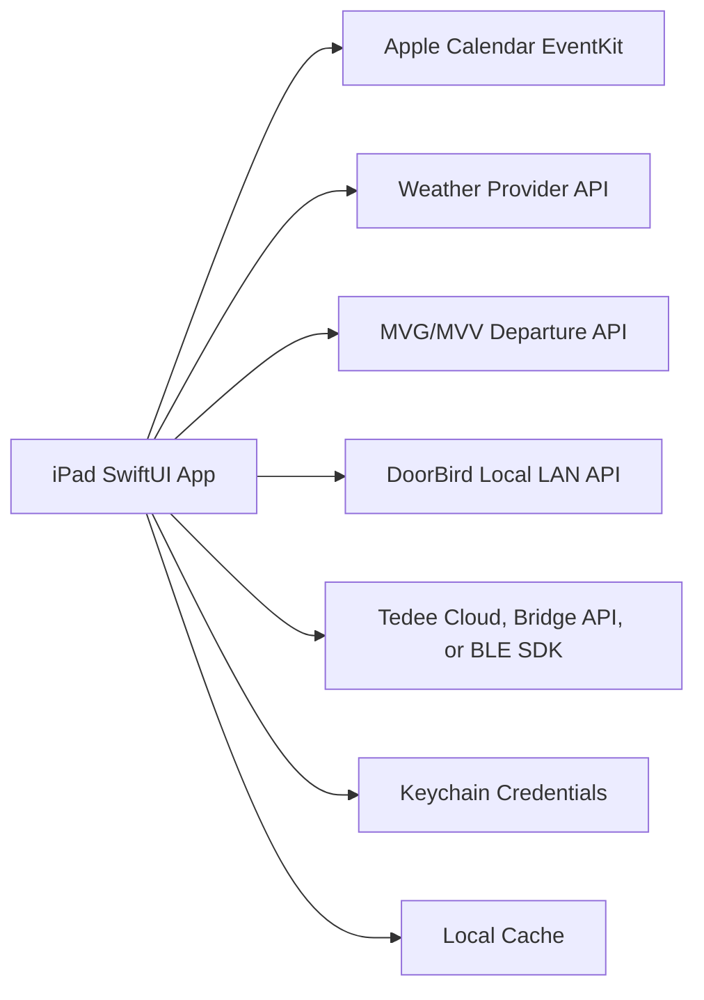

# Standalone iPad Home Dashboard Plan

## Target Project

- Build in `~/gitlab/ios-home-app`.
- Target device: 6th-generation iPad in portrait orientation.
- Runtime model: wall-mounted with power connection; user unlocks the iPad when needed.
- Visual requirement: dark-only UI that matches the supplied mockup exactly, using the Sketch file and Illustrator icon file as the source of truth.

## Direct Answer

Yes, you can create this as a standalone iPad app. The best fit is a native SwiftUI iPadOS app installed directly on your own iPad.

Yes, it can be done without running your own server if the app is intended to run on the iPad, fetch data directly from public/vendor APIs, and control devices either over the local network, Bluetooth, or vendor cloud APIs. Because the mounted iPad is unlocked manually when needed, v1 should refresh aggressively when the app enters the foreground rather than trying to provide custom background doorbell notifications. If instant custom ring alerts while the iPad is locked become required later, that is the point where APNs/provider infrastructure or the official DoorBird app matters.

## Recommended Architecture

Use a native SwiftUI app with a local-first integration layer:

## Scope For Version 1

- Show current date and time in the exact portrait dashboard layout from the mockup.
- Show current weather and tomorrow forecast.
- Show today's calendar events from Google Calendar, preferably through the iPad's native Calendar account sync and EventKit.
- Show live S-Bahn departures for S2 from Dachau Stadt and Dachau Bahnhof, grouped by station and direction.
- Show DoorBird snapshot/live view and a deliberate unlock/open action.
- Show Tedee lock state and deliberate lock/unlock/pull-spring actions.
- Render the smart-home shortcut area visually so the mockup is preserved, but keep the controls inert for v1.
- Avoid a custom backend for v1.

## Important Product Decisions

- Build native, not web-first: Native SwiftUI gives better iPad layout control, Keychain storage, local network access, Bluetooth access, calendar access, and device permissions.
- Match the design exactly before adding behavior: The Sketch file defines spacing, sizing, typography, panel positions, and colors; the Illustrator file defines icon geometry. Data integrations should not be allowed to reshape the UI.
- Lock orientation to portrait: The mounted 6th-generation iPad is the primary target, so v1 should prioritize that resolution over adaptive layouts.
- Dark-only theme: Do not implement a light variant. Force the app's appearance to the mockup's dark palette.
- Use EventKit first for calendar: Add your Google account under iPadOS Calendar settings, then the app reads local calendar events. This avoids building Google OAuth and sync logic in v1.
- Keep integrations modular: Each data source should be its own small client/service so DoorBird, Tedee, weather, and transit can be replaced independently.
- Prefer foreground refresh behavior: Refresh all panels when the app opens/unlocks and then continue timed refreshes while visible. Background push/event handling can be a later phase if needed.
- Store secrets only on-device: Use Keychain for API tokens, passwords, Tedee credentials/certificates, and DoorBird credentials.

## Distribution Plan

- For quick personal testing: use Xcode with a free Apple ID. This works for on-device testing but typically requires re-signing/reinstalling about every 7 days.
- For reliable personal daily use: enroll in the Apple Developer Program and install via development/ad-hoc/TestFlight-style workflows. This avoids the weekly free-provisioning friction and is the practical "set and forget" option for a private iPad app.
- Publishing to the App Store is not required.

## Implementation Phases

### Phase 1: Design Asset Extraction And App Shell

Create or open the SwiftUI project in `~/gitlab/ios-home-app`, extract the Sketch/Illustrator design details, and build the static dashboard first.

Expected files:
- `HomeDashboard/HomeDashboardApp.swift`
- `HomeDashboard/Views/DashboardView.swift`
- `HomeDashboard/Views/ClockPanel.swift`
- `HomeDashboard/Views/WeatherPanel.swift`
- `HomeDashboard/Views/CalendarPanel.swift`
- `HomeDashboard/Views/TransitPanel.swift`
- `HomeDashboard/Views/DoorPanel.swift`
- `HomeDashboard/Views/DeviceControlsPanel.swift`
- `HomeDashboard/Design/DesignTokens.swift`
- `HomeDashboard/Assets.xcassets`

Key work:
- Locate the Sketch and Illustrator files inside `~/gitlab/ios-home-app`.
- Extract exact portrait dimensions, colors, typography, line weights, opacity, grid positions, and icon assets.
- Recreate the screenshot's information hierarchy as a fixed portrait layout for the 6th-generation iPad.
- Use mock data for all panels.
- Force dark appearance and avoid light-mode variants.
- Keep visual placeholders for the smart-home icon grid even though those controls are not active in v1.
- Keep touch targets large for wall-mounted use.

Verification:
- The app renders correctly on a 6th-generation iPad in portrait.
- A screenshot of the running app visually matches the supplied mockup and design files before data integrations are added.
- The dashboard remains legible from a few meters away.
- Each panel can render loading, data, and error states using mock data.

### Phase 2: Local Data Model And Refresh Loop

Introduce shared models, app state, caching, and refresh scheduling.

Expected files:
- `HomeDashboard/Models/DashboardModels.swift`
- `HomeDashboard/Services/DashboardRefreshCoordinator.swift`
- `HomeDashboard/Services/LocalCache.swift`
- `HomeDashboard/Support/SecretsStore.swift`

Key work:
- Define normalized models for weather, events, departures, doorbell state, and lock state.
- Add foreground refresh behavior that runs when the app opens/unlocks and then continues with different intervals per data source while visible.
- Cache the last successful response so the dashboard does not go blank during network failures.
- Store credentials in Keychain, not in source files or user defaults.

Verification:
- The UI shows stale-but-labelled cached data when an integration fails.
- Refreshes do not block the main UI.
- Credentials are not committed or stored in plaintext.

### Phase 3: Calendar Integration

Read today's events through Apple EventKit.

Expected files:
- `HomeDashboard/Services/CalendarService.swift`
- `HomeDashboard/Views/CalendarPermissionView.swift`

Key work:
- Request full calendar read access.
- Read events for the current day from selected calendars.
- Let you choose which calendars appear on the dashboard.
- Handle all-day events, overlapping events, timezone boundaries, and permission denial.

Verification:
- Google Calendar events appear after the Google account is synced into iPadOS Calendar.
- Today's all-day, timed, overlapping, and multi-calendar events display correctly.
- Permission denial shows a clear setup message.

### Phase 4: Weather Integration

Fetch current and next-day weather directly from the app.

Expected files:
- `HomeDashboard/Services/WeatherService.swift`
- `HomeDashboard/Models/WeatherModels.swift`

Recommended options:
- Apple WeatherKit if you are comfortable with Apple developer setup and entitlements.
- Open-Meteo if you want a simple no-key weather API for a personal app.

Key work:
- Use a fixed home location or device location permission.
- Fetch current conditions, high/low, precipitation, and next-day forecast.
- Render simple icons matching the dashboard style.

Verification:
- Weather updates without a server.
- Loss of connectivity shows last known forecast and timestamp.
- The app does not require constant location tracking if a fixed home location is configured.

### Phase 5: MVG/MVV S-Bahn Departures

Fetch live departures for Dachau Stadt and Dachau Bahnhof, focused on S2 departures in the directions useful for the home dashboard.

Expected files:
- `HomeDashboard/Services/TransitService.swift`
- `HomeDashboard/Models/DashboardModels.swift`
- `HomeDashboard/Settings/AppSettings.swift`

Key work:
- Use MVG v3 departures endpoint: `https://www.mvg.de/api/bgw-pt/v3/departures`.
- Fetch both station IDs:
  - Dachau Stadt: `de:09174:6850`
  - Dachau Bahnhof: `de:09174:6800`
- Filter/group S2 departures into `Richtung München` and `Richtung Altomünster`.
- Treat S2 trains signed `Riem`, `Ostbahnhof`, `München`, `Erding`, `Leuchtenbergring`, etc. as München-bound.
- Omit `Richtung Petershausen` from the dashboard.
- Show planned time, realtime delay, minutes until departure, cancellations, and disruptions.

Verification:
- Departures match MVG live data for Dachau Stadt and Dachau Bahnhof.
- München-bound departures are visible first because they are the most important information.
- Direction grouping is correct.
- Cancelled or delayed departures are visually distinct.

### Phase 6: DoorBird Integration

Integrate DoorBird locally first.

Expected files:
- `HomeDashboard/Services/DoorBirdService.swift`
- `HomeDashboard/Views/DoorPanel.swift`
- `HomeDashboard/Settings/DoorBirdSettings.swift`

Key work:
- Configure DoorBird IP/hostname and a limited-permission DoorBird user.
- Request iPadOS local network permission.
- Load a snapshot and, if reliable, an MJPEG live stream.
- Add explicit open-door action with confirmation to avoid accidental taps.
- Consider leaving push/ring notifications to the official DoorBird app for v1.

Verification:
- Snapshot/live view works on the home LAN.
- Door open action requires deliberate confirmation.
- Failure states are clear when the iPad is off-network or DoorBird is unavailable.

### Phase 7: Tedee Integration

Choose Tedee control path based on your hardware and comfort level.

Expected files:
- `HomeDashboard/Services/TedeeService.swift`
- `HomeDashboard/Models/LockModels.swift`
- `HomeDashboard/Views/LockControlView.swift`
- `HomeDashboard/Settings/TedeeSettings.swift`

Recommended order:
- Start with Tedee Cloud API if you already use Tedee Bridge and want the simplest implementation.
- Consider Tedee Bridge local API if local-network operation is important.
- Consider Tedee iOS BLE SDK later if you want local direct lock control and are comfortable with certificates, expiration, and physical-device-only testing.

Key work:
- Fetch current lock state.
- Send lock/unlock/pull commands only after confirmation.
- Poll operation status until complete.
- Handle calibration, bridge offline, token expiration, and ambiguous lock state.

Verification:
- State shown in the dashboard matches the Tedee app.
- Lock/unlock commands complete and update the displayed state.
- Failed commands do not falsely show success.

### Phase 8: Settings And Setup UX

Add a private setup area for credentials and integration choices.

Expected files:
- `HomeDashboard/Views/SettingsView.swift`
- `HomeDashboard/Settings/AppSettings.swift`
- `HomeDashboard/Support/KeychainSecretsStore.swift`

Key work:
- Configure home location, calendar selection, station/directions, DoorBird host/user, Tedee integration mode, and refresh intervals.
- Protect dangerous actions with confirmation.
- Add a simple diagnostics screen for API status and last refresh times.

Verification:
- A fresh install can be configured without editing code.
- Invalid credentials are surfaced clearly.
- Secrets survive app restarts but are not exported casually.

## Testing Strategy

- Unit test service parsing for weather, transit, DoorBird responses, and Tedee responses.
- Use mock services for SwiftUI previews and UI tests.
- Run physical-device tests for EventKit, local network access, DoorBird, Tedee BLE if used, and portrait behavior on the 6th-generation iPad.
- Create a visual regression checklist against the Sketch/mockup: screenshot comparison, icon geometry, opacity, typography, alignment, and panel spacing.
- Create a manual home acceptance checklist: mounted iPad, plugged in, unlock/open behavior, Wi-Fi reconnect, router restart, DoorBird unavailable, Tedee bridge unavailable, and no internet.

## Risks And Mitigations

- iOS app signing friction: Use paid Apple Developer Program for daily long-term use if weekly free re-signing is annoying.
- Doorbell background events: Keep v1 foreground-only or rely on the official DoorBird app for push notifications. Add APNs/server-based event handling only if this becomes essential.
- Exact design fidelity: Extract tokens and assets from the design files first; do not approximate from the screenshot unless the source files are unavailable.
- Vendor API changes: Keep each integration behind a small service interface and show graceful failure states.
- Lock safety: Require confirmation, show current state, and never auto-unlock based on dashboard refresh alone.
- Credentials: Store all secrets in Keychain and use least-privilege DoorBird/Tedee credentials.
- No-server limitation: Remote access, push notifications, analytics, and cross-device sync are intentionally out of scope for v1.

## Resolved Implementation Decisions

- Runtime model: 6th-generation iPad, portrait, wall-mounted, powered, unlocked manually when needed.
- Typography replacement: use Panamera as the open-source replacement for PorscheNextTT, with fallback to system thin/regular weights until the font files are added.
- Calendar source: use EventKit against the iPadOS Calendar store after Google Calendar is synced into iPadOS.
- Weather source: use Open-Meteo for no-key weather data.
- S-Bahn source: use MVG `bgw-pt/v3/departures`, fetching both Dachau Stadt and Dachau Bahnhof.
- Smart-home shortcuts: render visually but keep inert for v1.

## Suggested V1 Milestone

Build the exact dark portrait app shell first from the Sketch/Illustrator files, then add clock, calendar via EventKit, weather, S-Bahn departures, DoorBird snapshot/live view, and Tedee cloud control. Keep foreground-only behavior, no custom backend, no custom push notifications, and visually present but inert smart-home controls. After that works reliably on the mounted iPad, decide whether background doorbell events justify adding a tiny server or APNs provider later.
